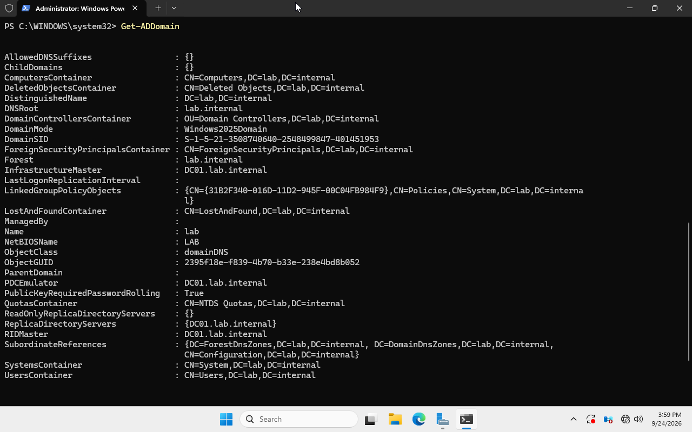
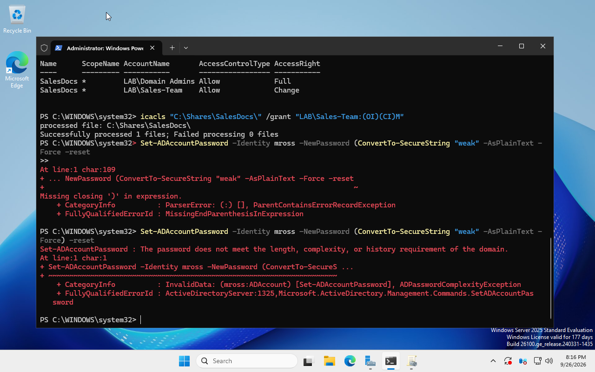

# Active Directory Configuration

## Organizational Units

Created to mirror a realistic small-org structure:

- `Employees`
- `IT`
- `Sales`
- `HR`

Domain confirmed via:

```powershell
Get-ADDomain
```



## Users and groups

Sample users were created in their respective OUs via PowerShell:

```powershell
New-ADUser -Name "Jane Doe" -SamAccountName jdoe -UserPrincipalName jdoe@lab.internal `
  -Path "OU=Employees,DC=lab,DC=internal" `
  -AccountPassword (ConvertTo-SecureString "LabPass123!" -AsPlainText -Force) -Enabled $true

New-ADUser -Name "Mike Ross" -SamAccountName mross -UserPrincipalName mross@lab.internal `
  -Path "OU=Sales,DC=lab,DC=internal" `
  -AccountPassword (ConvertTo-SecureString "LabPass123!" -AsPlainText -Force) -Enabled $true
```

A security group was created to control share access:

```powershell
New-ADGroup -Name "Sales-Team" -GroupScope Global -Path "OU=Sales,DC=lab,DC=internal"
Add-ADGroupMember -Identity "Sales-Team" -Members mross
```

**Note:** `New-ADUser` places accounts in the built-in `Users` container by default
unless `-Path` is specified. This caused a real issue — see Troubleshooting Log.

## Domain password policy

```powershell
Set-ADDefaultDomainPasswordPolicy -Identity lab.internal `
  -MinPasswordLength 10 -PasswordHistoryCount 5 `
  -LockoutThreshold 5 -LockoutDuration 00:30:00 -LockoutObservationWindow 00:30:00
```

Verified with `Get-ADDefaultDomainPasswordPolicy`.

Enforcement confirmed — attempting to set a weak password was rejected:



## File share with layered permissions

A shared folder was created on DC01, with access controlled at both the share
and NTFS level, restricted to the `Sales-Team` security group:

```powershell
New-Item -Path "C:\Shares\SalesDocs" -ItemType Directory
New-SmbShare -Name "SalesDocs" -Path "C:\Shares\SalesDocs" -FullAccess "LAB\Domain Admins"
Grant-SmbShareAccess -Name "SalesDocs" -AccountName "LAB\Sales-Team" -AccessRight Change -Force
icacls "C:\Shares\SalesDocs" /grant
