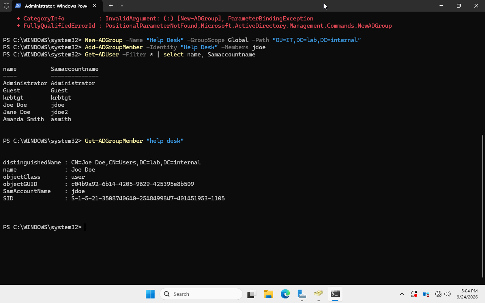
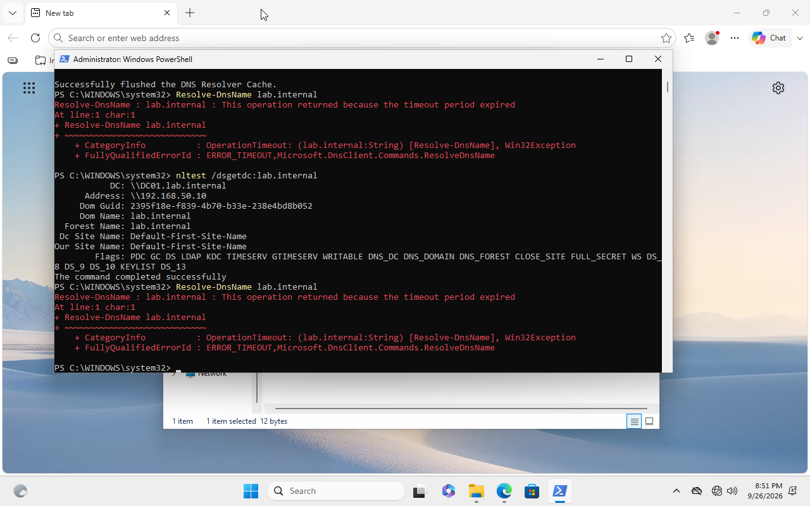
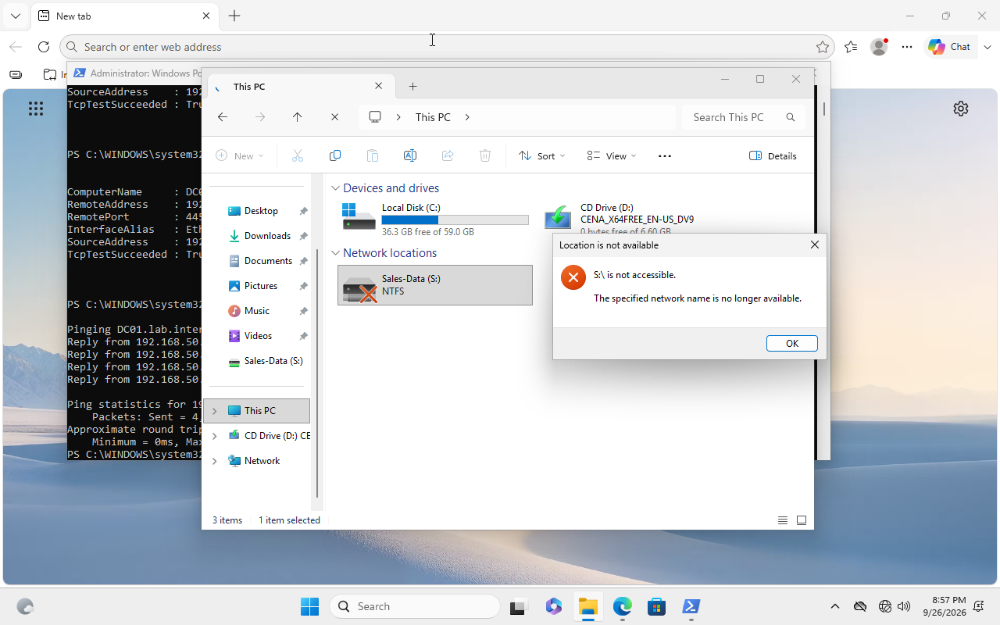
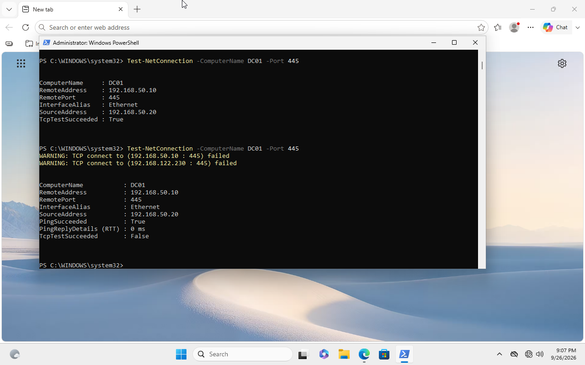

# Troubleshooting Log

Real issues encountered while building and operating the lab, documented with
the actual diagnostic steps taken. A few of these were intentionally staged to
practice a support-ticket workflow; most were genuine problems that came up
organically.

---

## 1. Dual-NIC static IP bound to the wrong adapter

**Symptom:** CLIENT01 could not ping DC01 by IP, despite both VMs showing
correct-looking network configuration.

**Diagnosis:**
- Confirmed CLIENT01's own IP config was correct (`ipconfig /all`)
- Confirmed both VMs' NICs were attached to the same virtual network (`lab-net`)
  in virt-manager
- Found that DC01 has two NICs (one for `lab-net`, one for NAT/internet), and
  the static IP `192.168.50.10` had been applied to the **NAT-facing NIC**
  instead of the lab-net NIC

**Fix:** Identified each NIC by MAC address (cross-referencing virt-manager's
hardware view against `Get-NetAdapter -IncludeHidden | Format-Table Name, MacAddress`),
removed the static IP from the wrong adapter, set it to DHCP, and applied the
static IP to the correct lab-net adapter.

**Takeaway:** Dual-NIC VMs are a realistic source of exactly this kind of
misconfiguration — Windows doesn't label adapters by purpose, so matching by
MAC address is the reliable way to identify them.

---

## 2. GPO not applying to a domain user

**Symptom:** A Group Policy restricting Control Panel access (linked to the
`Employees` OU) had no effect on user `jdoe`, even after `gpupdate /force`
and a full logoff/logon.

**Diagnosis:**
```powershell
Get-ADUser jdoe | Select DistinguishedName
```
showed `jdoe` was sitting in the built-in `Users` container, not the
`Employees` OU. GPOs cannot link to the built-in `Users` container at all —
it's a legacy container, not a true OU.



**Root cause:** `New-ADUser` defaults to the `Users` container when `-Path`
isn't explicitly specified.

**Fix:**
```powershell
Get-ADUser jdoe | Move-ADObject -TargetPath "OU=Employees,DC=lab,DC=internal"
```
followed by `gpupdate /force` and a full logon.

**Takeaway:** A very common real-world AD mistake. Worth checking object
placement early whenever a GPO "mysteriously" isn't applying.

---

## 3. Account lockout (simulated ticket: "user can't log in")

**Simulated by:** repeated failed authentication attempts against `mross`
from CLIENT01 (`net use` with a deliberately wrong password, 6 times, to
exceed the configured `LockoutThreshold 5`).

**Diagnosis:**
```powershell
Get-ADUser mross -Properties LockedOut, BadLogonCount, badPwdCount
Get-WinEvent -LogName Security -FilterXPath "*[System[EventID=4740]]" -MaxEvents 5
```
Confirmed `LockedOut: True` and located the corresponding lockout event (ID 4740).

**Fix:**
```powershell
Unlock-ADAccount -Identity mross
```

---

## 4. DNS misconfiguration (simulated ticket: "can't access shared drive")

**Simulated by:** pointing CLIENT01's DNS at a public resolver (`8.8.8.8`)
instead of DC01.

**Diagnosis:** Initial `\\DC01\SalesDocs` access attempts still worked
despite broken DNS — Windows fell back to NetBIOS/LLMNR name resolution,
which works on a flat single-subnet network like this lab but would not
work across subnets in a larger environment.

Confirmed the actual DNS failure with:
```powershell
Resolve-DnsName lab.internal
nltest /dsgetdc:lab.internal
```
Both failed, confirming domain controller discovery (which strictly requires
DNS) was broken, even though file share access "appeared" fine.





**Fix:**
```powershell
Set-DnsClientServerAddress -InterfaceAlias "Ethernet" -ServerAddresses 192.168.50.10
```

**Takeaway:** A DNS failure can be partially masked by legacy fallback
mechanisms on a flat network, but domain controller discovery, GPO
processing, and Kerberos authentication depend on DNS working correctly.
`nltest /dsgetdc` is a more reliable diagnostic than testing file access alone.

---

## 5. SMB service outage (simulated ticket: "drive mapping stopped working")

**Simulated by:** stopping the Server service on DC01 (`Stop-Service LanmanServer`).

**Diagnosis:**
```powershell
Test-NetConnection -ComputerName DC01 -Port 445   # False
ping DC01                                          # succeeded
```
The contrast (ping working, port 445 closed) isolated the issue specifically
to SMB/file sharing rather than general connectivity or DNS.



**Complication:** After restarting the service, port 445 still showed open
on a prior check — the SMB kernel-mode listener didn't immediately release
the socket even though the service reported "Stopped." A full reboot of
DC01 was needed to get a clean "truly down" state for testing.

**Fix:**
```powershell
Set-Service -Name LanmanServer -StartupType Automatic
Start-Service -Name LanmanServer
```

---

## 6. Kerberoasting: clock skew between Kali and DC01

**Symptom:** `impacket-GetUserSPNs` failed with
`KRB_AP_ERR_SKEW (Clock skew too great)`.

**Diagnosis:** Compared UTC time on both machines (`date -u` on Kali,
`Get-Date -Format u` on DC01) and found DC01's clock had drifted roughly
4 hours behind real time — expected, since DC01 has no NTP source configured
on the isolated network.

**Fix:**
```powershell
Set-Date -Date "2026-10-02T02:02:00Z"
```
on DC01, manually syncing it to real-world UTC time.

---

## 7. Kerberoasting: unsupported encryption type

**Symptom:** After fixing clock skew, the ticket request failed with
`KDC_ERR_ETYPE_NOSUPP`.

**Diagnosis:** The target service account (`svc-sql`) had no explicit
Kerberos encryption types configured, and the DC's default did not align
with what Impacket requested.

**Fix:**
```powershell
Set-ADUser svc-sql -KerberosEncryptionType AES128,AES256
```

---

## 8. Kerberoasting: wrong hashcat mode

**Symptom:** A valid-looking Kerberoast hash (`$krb5tgs$18$...`) was
rejected by hashcat with "Separator unmatched" under mode `13100`.

**Diagnosis:** Mode `13100` is specifically for RC4-encrypted tickets
(etype 23). The `18` in the hash string indicates **AES256** (etype 18),
which uses a different hashcat mode entirely.

**Fix:** Used the correct mode for AES256 Kerberoast hashes:
```bash
hashcat -m 19700 spn_hash.txt /usr/share/wordlists/rockyou.txt
```

**Takeaway:** Kerberoast hash formats differ by encryption type, and modern
AD environments increasingly enforce AES over legacy RC4. This also means
AES-based Kerberoasting is significantly slower to crack than the RC4
examples most tutorials demonstrate — a real reflection of why enforcing
AES-only Kerberos encryption is a meaningful hardening step.
